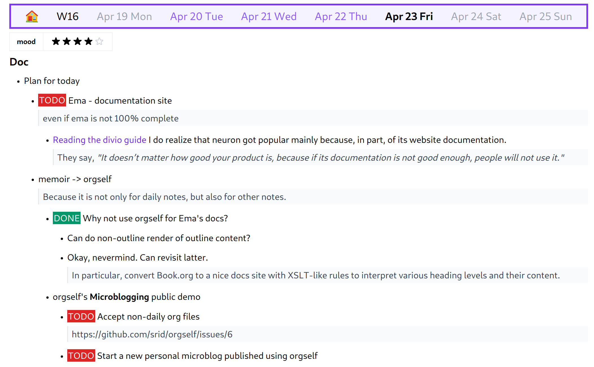

# orgself

*This project is in an ongoing research phase; it is not ready for general use. But feel free to play with it and provide feedback.*

Create a beautiful journal website with [self-tracking](https://en.wikipedia.org/wiki/Quantified_self) based on org-mode outlines. Orgself is powered by [ema](https://github.com/srid/ema).



## Motivation

[Zettelkasten](https://neuron.zettel.page/) is appropriate for taking notes that are "structured" only at the level of connections and atomic ideas. Outliners are more suitable where fine-grained structures and a little bit of hierarchy is desired. Orgself explores a specific kind of outlines called **calendar outlines**. See [the chronicle project](https://github.com/srid/chronicle) for prior ideas on this. The question we may ask is: what sort of **emergent information** (knowledge, wisdom, etc.), pertaining to self, can we build *over time* on top of this calendar outline?

## Running

```bash
ln -s $(pwd)/example ~/org 
bin/run
```

Or <kbd>Ctrl+Shift+B</kbd> in VSCode.

## Upgrading ema

Open `flake.nix` and change `ema.url` to point to a new revision.

## Credits

- [Org Mode](https://orgmode.org/) (file format used)
- [Org Mode Haskell parser](https://github.com/fosskers/org-mode)
